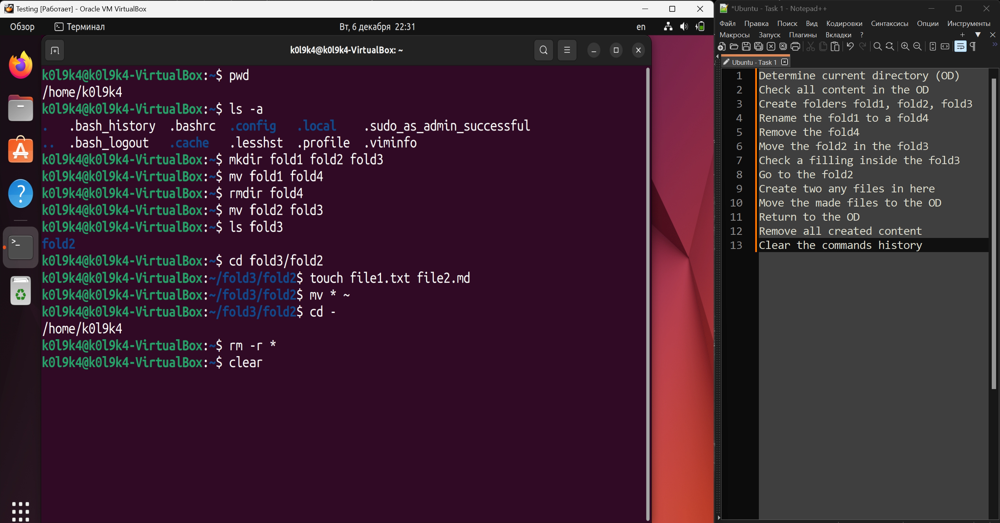

# Task 1: Using **_pwd, ls, mkdir, mv, rm, touch_**   
## Conditions of the task:
1. Determine current directory (OD)
2. Check all content in the OD
3. Create folders **fold1**, **fold2**, **fold3**
4. Rename the **fold1** to a **fold4** 
5. Remove the **fold4**
6. Move the **fold2** in the **fold3**
7. Check a filling inside the **fold3**
8. Go to the **fold2**
9. Create two any files in here
10. Move the made files to the OD
11. Return to the OD
12. Remove all created content
13. Clear the commands history
___
note: **_to force the solution to be working from the beginning just refresh your browser page_**

## Solution of the task:
.gif)
___
## Complete solution overview
